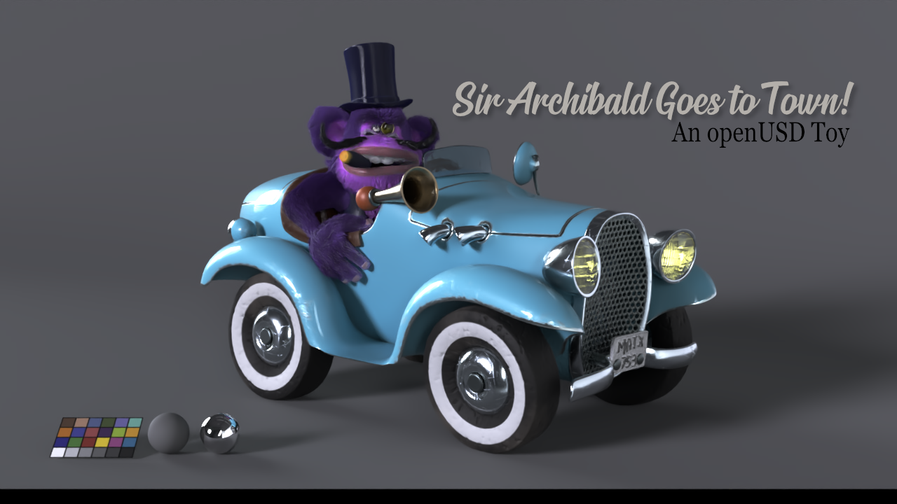

# Sir Archibald Goes to Town - An openUSD Toy!

-------------------------------------------------------------------------------------------------------------------------------------
While  is an abundance of high-quality openUSD sample scenes available online, many of them tend to be either overly complex and heavy (such as the AnimalLogic Lab and nVidia Attic examples) or excessively simple and specialized. Finding examples with a moderate amount of data, inclusive of the most common functions, can be challenging.

Motivated by this gap, I designed this project to serve as a middle-ground reference for those looking to explore openUSD in a more approachable yet versatile context. 

The project demonstrates one of the many ways a openUSD stage (i.e., asset or shot) can be composed, following a structure that is similar to the guideline from the USD Working Group but seasoned by personal preferences. 

The project is designed for a single scene, with a focus on portability, ease of understanding, and ease of modification, making it an excellent resource for those new to openUSD or the ones who are looking for an openUSD toy to play with in their DCC of choice.

The included guideline goes over the concept and external structure of the scene without getting into the technical details and the internal structure of the components.

-------------------------------------------------------------------------------------------------------------------------------------

license: This work is licensed under Creative Commons Attribution-ShareAlike 4.0 International License.
